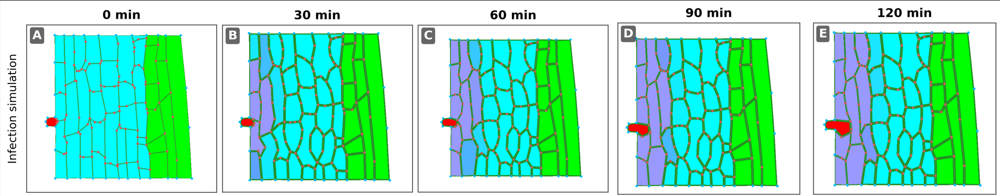
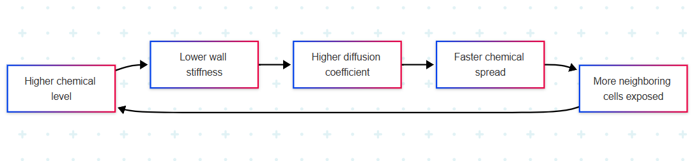
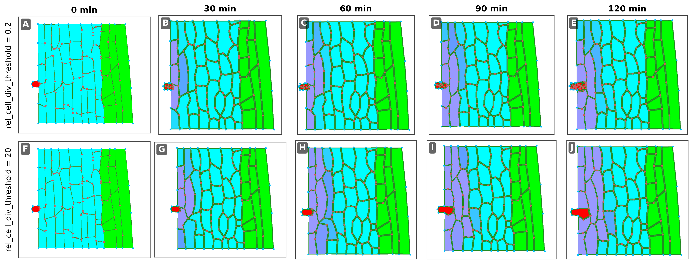

# Assignment 5 

**Course:** KEN3170 — Multi-scale modeling of biological systems  
**Group:** 4

| Group member | Student ID |
|---|---|
| Vasileios Dedousis | I6372281 |
| Lars van Dijnen | I6404000 |
| Wail Djeha | I6353401 |
| Rafal Dorsz | I6367552 |

Answers on the infection simulation, the `CellHouseKeeping` and `CelltoCellTransport` functions, the effect of `rel_cell_div_threshold`, a comparison with the auxin-growth model, and a proposed defense mechanism.

## Contents
0. [Introduction](#0-introduction)
1. [Spatial spread and tissue deformation](#1-spatial-spread-and-tissue-deformation)
2. [`CellHouseKeeping`: chemical signal and wall stiffness](#2-cellhousekeeping-chemical-signal-and-wall-stiffness)
3. [`CelltoCellTransport`: stiffness-dependent diffusion](#3-celltocelltransport-stiffness-dependent-diffusion)
4. [Effect of `rel_cell_div_threshold`](#4-effect-of-rel_cell_div_threshold)
5. [Cell neighbours compared with earlier course models](#5-cell-neighbours-compared-with-earlier-course-models)
6. [Proposed wall-stiffening defense response](#6-proposed-wall-stiffening-defense-response)
7. [Conclusion](#7-conclusion)

## How to run

Use the VirtualLeaf version supplied for the practical and open the `pathogen_infection` model (`pathogen_infection.xml`). Run it for 2 hours and save screenshots at 0, 30, 60, 90, and 120 minutes. For the parameter comparison, restart from the same initial tissue for each run, set `rel_cell_div_threshold` to 0.2 or 20, and keep other settings unchanged. No additional programming is required. Keep the `images/` folder beside this README so the figures display correctly.

## 0. Introduction

In this assignment we  used the VirtualLeaf infection model to investigate how pathogen growth, chemical signaling, cell-wall mechanics, and tissue deformation are coupled within a simulated plant tissue. The approach combined inspection of the model code with controlled parameter changes and time-course visualization. Most attention was given to the `CellHouseKeeping`, `CelltoCellTransport`, `CellDynamics`, and `SetCellColor` functions, since these define all relevant aspects of pathogen growth and division and visualization of infection intensity. 

In the model, pathogen cells grow and divide, produce an infection-associated chemical, and expose neighboring host cells to that signal; host-cell wall stiffness decreases once the chemical exceeds a threshold, while the effective diffusion coefficient increases as stiffness decreases. 

The simulation was first followed over a two-hour period using snapshots taken at regular intervals to observe how the chemically affected region spread from the pathogen entry site and how the surrounding tissue deformed. 

The model was then perturbed by changing the relative cell-division threshold of the pathogen. A low threshold (`rel_cell_div_threshold` = 0.2) was used to promote frequent pathogen division, while a high threshold (`rel_cell_div_threshold` = 20) was used to suppress division and favor enlargement of existing pathogen cells. These runs were compared in terms of pathogen population expansion, chemical spread, host-cell color changes, wall weakening, and tissue deformation. 

Finally, we examined the model structure to identify how host defense could be incorporated. A hypothetical response was considered in which host cells stiffen their walls once the pathogen-associated chemical exceeds a defense threshold. 

## 1. Spatial spread and tissue deformation

### Spread of the infection

Over the 2-hour simulation, the infected area gradually spread from the pathogen at the left side of the tissue.

| Time | Observation |
|---|---|
| Start | Only the cells directly next to the pathogen were affected. |
| ~30–60 min | The affected area spread mainly along the left side and started moving into nearby cells. |
| ~90–120 min | A larger region close to the infection site was affected, while the middle and right side of the tissue were still less affected. |


At the start of the simulation, the affected area was confined to cells immediately adjacent to the pathogen. After approximately 30–60 min, the altered region had spread mainly along the outer left-hand cell layers, while also beginning to extend inward toward neighboring cells. By 90–120 min, a larger continuous region near the infection site was affected, whereas the central and right-hand side of the tissue remained comparatively less altered. This indicates that the pathogen effect spreads locally through neighboring cells rather than uniformly across the tissue.



### Tissue deformation

The shape of the tissue also changed as the infection spread. Cells near the pathogen became less regular in shape and their walls appeared more curved and distorted. The tissue close to the infection site was also pushed out of its original arrangement. This happens because the pathogen-related chemical weakens the cell walls. Weaker walls are easier to deform, so infected cells change shape more easily. Since neighboring plant cells share walls, these changes can also affect nearby cells that are not as strongly infected.

### Summary

Overall, the infection spread gradually from the pathogen into nearby cells and caused increasing changes in tissue shape. The strongest effects remained close to the infection site, where the cell walls were most weakened and the tissue showed the most visible deformation.


## 2. `CellHouseKeeping`: chemical signal and wall stiffness

The `CellHouseKeeping` function connects the pathogen-associated chemical signal to changes in the mechanical properties of plant cell walls. For each cell, the chemical level is first converted into a normalized pathogen signal. This value is limited to a maximum of 1.2.

### Wall stiffness rule
In uninfected conditions, the wall stiffness is set to 3. Once the normalized signal exceeds 0.1 (corresponding to `Chemical(0) > 0.05`), the stiffness of host-cell wall elements is progressively reduced according to `wallstifness`= 3 - `patho_chem_level`. Higher concentrations of the pathogen-associated chemical therefore make the cell walls gradually weaker and easier to deform. Because the signal is limited to 1.2, the minimum wall stiffness produced by this rule is 1.8. Cells below the threshold keep the default stiffness of 3.

### Mechanical consequence

This reduction in stiffness provides the mechanical basis for the deformation observed during infection. Cells exposed to higher chemical levels are less resistant to stretching and can therefore deform more easily under internal and neighboring-cell forces. Since wall elements are shared within the tissue, local weakening can also alter the stress distribution in surrounding cells, contributing to deformation beyond the most strongly affected region.

### Treatment of pathogen cells

Pathogen cells are treated differently from normal plant cells. Cells with `CellType()==2` continuously increase their target area and divide once they exceed the specified size threshold.
They are explicitly excluded from the chemical-dependent weakening rule, so their wall stiffness remains at the default value of 3.

### Summary

The model separates the roles of the pathogen and the surrounding host tissue. The pathogen grows and divides, while the chemical signal associated with infection causes nearby plant cells to lose wall stiffness. The resulting spatial gradient in chemical concentration produces a corresponding gradient in mechanical weakening and tissue deformation.


## 3. `CelltoCellTransport`: stiffness-dependent diffusion

The `CelltoCellTransport` function makes the diffusion of the pathogen-associated chemical depend directly on the mechanical stiffness of the cell wall between two neighboring cells.

When the wall stiffness is above 0.001:

$$
D_{\text{eff}} = \frac{0.00001}{\text{stiffness}}
$$

Stiff walls have a low diffusion coefficient, whereas weakened walls have a higher one. If stiffness becomes extremely small, the code avoids division by a near-zero value by setting the diffusion coefficient to 0.00001.

### Chemical flux

The flux across a wall is:

$$
\text{flux} = L \, D_{\text{eff}} \, (C_2 - C_1)
$$

where $L$ is the wall length and $C_1$, $C_2$ are the chemical levels in the two neighboring cells. Movement is driven by the concentration difference, but its rate is modulated by wall stiffness. The factors `corr1` and `corr2` seem to adjust how the chemical movement is divided between the two cells based on their relative sizes.

### Positive feedback loop

Together with the `CellHouseKeeping` rule, this creates a reinforcing feedback loop. Increasing chemical concentration weakens the wall by reducing its stiffness. The lower stiffness increases the diffusion coefficient, allowing the chemical to spread more rapidly through that wall. As the chemical reaches neighboring cells, their walls are weakened as well, which further facilitates diffusion into additional cells.



The initial chemical signal creates changes that help it spread even further. As the infection weakens the surrounding cell walls, the signal can move more easily into nearby cells, allowing the infected area to continue expanding.

### Summary

The model couples chemical transport and tissue mechanics in both directions: the chemical changes the mechanical properties of the wall, while the mechanical state of the wall determines how quickly the chemical diffuses. This provides a mechanism for the initially localized infection to accelerate and expand through adjacent tissue over time.


## 4. Effect of `rel_cell_div_threshold`

The figure compares two runs using division thresholds of 0.2 and 20.



### Low division threshold: `rel_cell_div_threshold = 0.2`

Pathogen cells divide when their area exceeds `0.2 * BaseArea()`. Their target area increases through `EnlargeTargetArea(2)`, so the lower threshold permits division at a smaller size. The top row shows many small red pathogen cells forming a cluster. The pathogen population therefore expands faster in cell number.

### High division threshold: `rel_cell_div_threshold = 20`

Pathogen cells must exceed `20 * BaseArea()` before dividing. In the bottom row, the red pathogen remains mainly a single enlarging cell during the two-hour run. Population expansion through division is therefore much slower, although the existing pathogen still grows and deforms nearby tissue.

### Chemical spread and deformation

Both runs show host-cell colour changes concentrated along the left side and changes in cell shape near the pathogen. The clearest visible difference is the many small pathogen cells at 0.2 compared with the large pathogen cell at 20. The chemically affected regions look broadly similar in these screenshots, so we cannot conclude from them alone that one run has much faster chemical spread or substantially stronger overall deformation.

The code assigns `dchem[0] = 0.1` to each pathogen cell. More pathogen cells means more cells acting as chemical sources, but this alone does not prove a proportional increase in the total amount of chemical: cell sizes, division, transport, and degradation also matter. Host cells degrade the chemical according to `dchem[0] = -0.001 * Chemical(0)`.

### Summary

Lowering the threshold increases pathogen division and creates many small cells. Raising it suppresses division and favours enlargement of existing cells. These observations answer the question about pathogen population expansion; the screenshots provide weaker evidence for differences in chemical spread.

## 5. Cell neighbours compared with earlier course models

In VirtualLeaf, cells occupy explicit positions and have shapes. Two cells are neighbours when they share a wall, and chemical transport occurs across that wall. The neighbour relationships are therefore determined by the tissue geometry. Cell growth, division, and permitted rearrangements can change which cells are neighbours and the length of their shared walls.

This differs from the earlier course models: epidemic compartments mix populations without representing individual cell contacts, metabolic networks connect metabolites through reactions, and Boolean networks use specified regulatory connections. Here, interactions depend on physical contact in a deformable tissue rather than only on predefined network connections or population-level mixing.

The presence of both pathogen and plant cells matters biologically, but the fundamental difference is the explicit spatial and mechanical definition of neighbours.

## 6. Proposed wall-stiffening defense response

A possible plant defense mechanism would be to make host cells increase their wall stiffness once the pathogen-associated chemical exceeds a defined defense threshold. This rule would fit naturally into `CellHouseKeeping`, in the same section where the current model reads `Chemical(0)` and calculates the wall stiffness.

### Pseudocode

```text
CellHouseKeeping(cell)

    1. PATHOGEN GROWTH
       If cell is a pathogen:
           increase target area
           if division threshold is reached:
               divide

    2. INITIALIZE WALL PROPERTIES
       For each wall element:
           if base length has not yet been assigned:
               assign base length

    3. READ PATHOGEN SIGNAL
       chemical_level = Chemical(0)

    4. DETERMINE HOST-CELL RESPONSE

       If cell is a normal plant cell:

           If chemical_level > defense_threshold:
               set wall stiffness above normal value
               // defensive wall reinforcement

           Else if chemical_level > weakening_threshold:
               reduce wall stiffness according to chemical level
               // infection-induced weakening

           Else:
               set wall stiffness to normal value

    5. APPLY WALL STIFFNESS
       For every wall element belonging to the cell:
           assign the calculated stiffness
```

The defense rule would be inserted into the existing cell-wall weakening section, after the pathogen chemical level has been calculated but before the final stiffness is applied to all wall elements.

### Feedback analysis

This defense mechanism would introduce negative feedback. As mentioned before, in the current model, increasing chemical concentration lowers wall stiffness. Since  a weaker wall produces faster diffusion, the chemical is allowed to spread farther:

$$
\text{chemical} \uparrow \rightarrow \text{stiffness} \downarrow \rightarrow D_{\text{eff}} \uparrow \rightarrow \text{chemical spread} \uparrow
$$

Once the chemical concentration exceeds the defense threshold, the proposed defense acts in the opposite direction:

$$
\text{chemical} \uparrow \rightarrow \text{stiffness} \uparrow \rightarrow D_{\text{eff}} \downarrow \rightarrow \text{chemical spread} \downarrow
$$

This is negative feedback because the infection signal triggers a host response that reduces the ability of that signal to spread further. The modified model would therefore contain a competition between pathogen-driven positive feedback through wall weakening and plant-driven negative feedback through wall reinforcement.

## 7. Conclusion

In this analysis we combined inspection of the model code with simulation runs to understand how the infection spreads through the tissue. By following the simulation over time and changing the pathogen division threshold, it was possible to see how pathogen growth affects the spread of the infection signal, the weakening of nearby cell walls, and the resulting changes in tissue shape.

The runs show that a lower division threshold produces many small pathogen cells, whereas a higher threshold produces mainly one enlarging pathogen cell. Both runs show a chemically affected region near the infection site; the screenshots do not establish a large difference in chemical spread. Looking at the code alongside the simulation also helped explain why these changes occur. Overall, the model provides a useful way to connect simple cell-level rules with the larger-scale behavior of an infected plant tissue.

